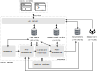

ICON is structured as a modular backend-frontend system.

{ width="100%" }

The backend server runs as multiple processes, each with a clear responsibility:

* **API Server**

    The main process. It exposes API endpoints ("controllers") via `pydase`. All communication between clients and the backend goes through this server.

    * Provides experiment and parameter metadata from the experiment library.
    * Allows parameter values in InfluxDB to be read and updated.
    * Provides access to data from running and past jobs.
    * Accepts new jobs, storing them in the SQLite job table.

* **Scheduler**

    Retrieves jobs from the SQLite database and dispatches them to workers. Jobs are assigned a priority, then pushed into a priority queue consumed by the pre-processing workers.

* **Pre-Processing Workers**

    One or more workers that prepare jobs before execution. For each job, they:

    * Fetch the relevant parameters from InfluxDB.
    * Generate JSON sequences for each data point using the experiment library.
    * Place the prepared data points into the queue consumed by the hardware worker.

* **Hardware Worker**

    A single worker that interfaces with the control hardware and external devices. For each data point:

    * Ensures device parameters are set if they are part of the scan.
    * Executes the JSON sequence on the control hardware.
    * Places the raw results into the queue for post-processing.

* **Post-Processing Worker**

    Currently a single worker (but can be scaled out). It:

    * Processes raw results.
    * Stores experiment data into HDF5 files.
    * Updates parameter values in InfluxDB when appropriate (e.g. calibrations - not yet implemented).

**Clients** connect to the API server via Socket.IO and provide user interfaces:

* **Web browser client (React/TypeScript)** - the main interface for scheduling experiments, configuring parameters, visualising live and past data, and controlling devices.
* **Python client** - intended for scripting and automation (work in progress).
