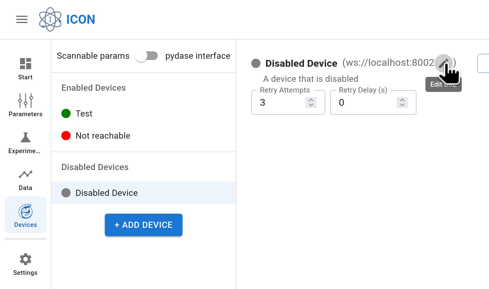
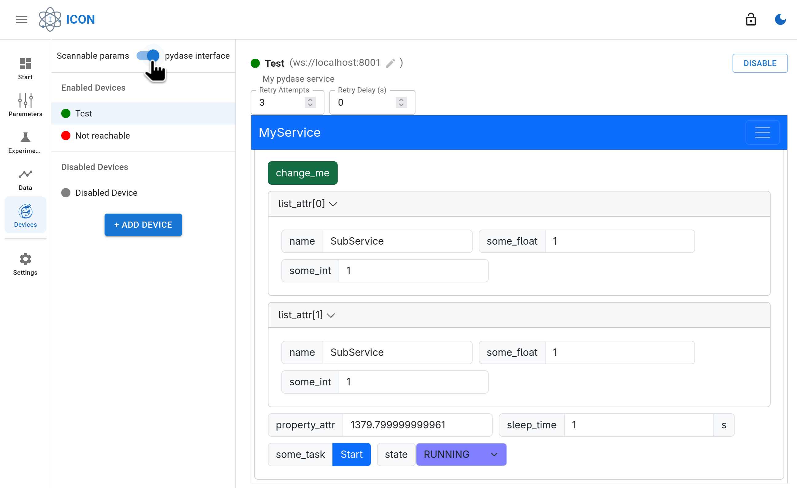

The **Devices** page gives you an overview of all devices connected to ICON. Devices are `pydase` services that ICON communicates with. They can be controlled through the ICON interface, and their parameters can be included in experiment scans.

You can add new devices by clicking the **+ Add Device** button on the left.

## Device states

Devices can be **enabled** or **disabled**:

* **Enabled devices**
    * ICON automatically attempts to connect to them.
    * A reachability indicator shows whether the device is online.
    * For reachable devices, you see:
        * A list of scannable parameters (`int` or `float`).
        * A **Disable** button.
        * Two configuration fields:
            * **Retry Attempts** – how many times the hardware worker should check if the desired parameter value was set.
            * **Retry Delay (s)** – how long to wait between checks.

            These settings are used by the hardware worker to verify that parameter changes succeeded. If the checks fail, the job is marked as *FAILED*.

* **Disabled devices**
    * ICON does not attempt to connect to them.
    * You can still edit the device’s **URL** that was defined when adding it.

## Display modes

You can toggle between two views:

* **Scannable parameters** – shows parameters of type `int` or `float` that can be used in experiment scans.
* **pydase interface** – embeds the device’s native `pydase` frontend via an `iframe`.

